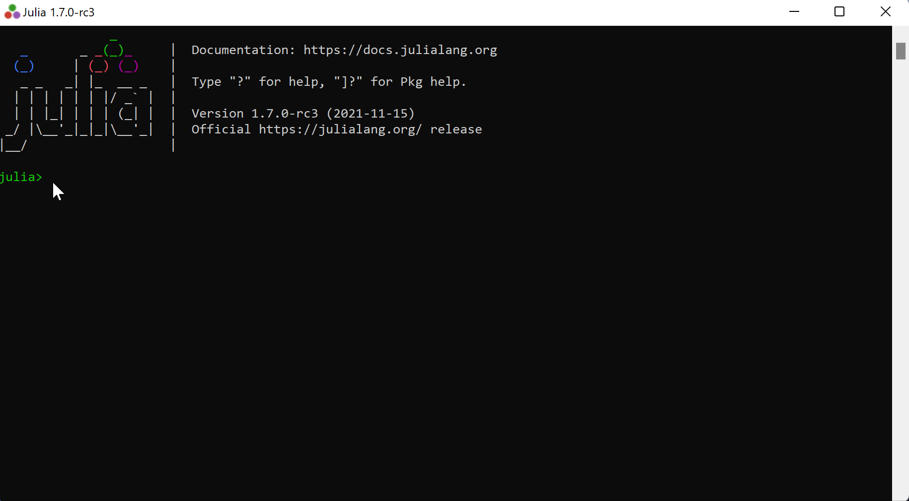
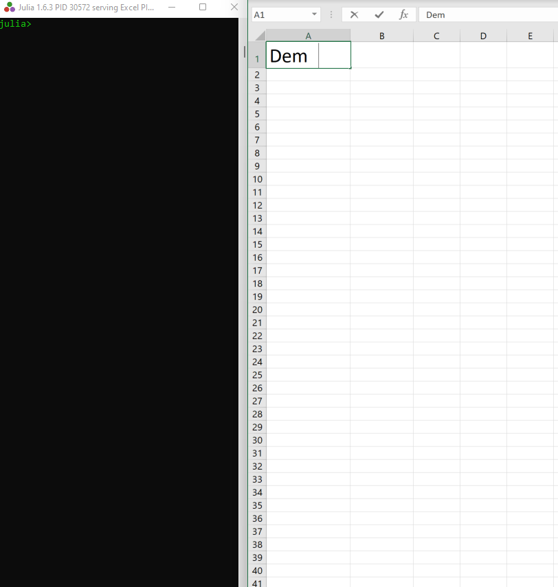

# JuliaExcel

Call [Julia](https://julialang.org/) from Microsoft Excel worksheets and from VBA.  

Compatible with Excel's [dynamic array formulas](https://support.microsoft.com/en-us/office/dynamic-array-formulas-and-spilled-array-behavior-205c6b06-03ba-4151-89a1-87a7eb36e531).

Support Excel for Windows (not Mac). Julia can be run under Windows or Linux (via [WSL](https://docs.microsoft.com/en-us/windows/wsl/about)).

## Contents
[Installation](#installation)  
[Installation (Linux)](#installation-linux)  
[Functions](#functions)   
[Demo](#demo)  
[Example VBA](#example-vba)  
[Function Documentation](#function-documentation)  
[Marshalling](#marshalling)  
[Alternatives](#alternatives)  
[Compatibility](#compatibility)  
[Viewing the code](#viewing-the-code)  
[How JuliaExcel works](#how-juliaexcel-works)  
[Shortcomings](#shortcomings)  

## Installation
Installation does not require admin rights on the PC.
 * Both Julia and Microsoft Office must be installed on your PC, with Excel not running.
 * Ensure that the default terminal application is "Windows Console Host". See [issue 9](https://github.com/PGS62/JuliaExcel.jl/issues/9) for instructions.
 * Launch Julia, and copy-paste the following command into the REPL:  
   ```
   using Pkg
   Pkg.add(url="https://github.com/PGS62/JuliaExcel.jl",rev="v0.2.16")
   using JuliaExcel;JuliaExcel.installme()
   
   ```
   (paste into the REPL is via mouse right-click).
 * Click through a couple of dialogs.
 * Launch Excel. Check that the JuliaExcel functions are available by typing `=Julia` into a worksheet cell and checking that the auto-complete offers `JuliaCall`, `JuliaEval`, `JuliaInclude` etc.

The process is illustrated in the GIF below. F5 to replay.



## Installation (Linux)
As an alternative to calling Julia running in a Windows process, JuliaExcel can call Julia running in a Linux process under Windows Subsystem for Linux (WSL). If that's your preference, then in addition to the steps described above, you need to:
 * If necessary, install [WSL](https://docs.microsoft.com/en-us/windows/wsl/install) with the default Linux distribution, Ubuntu.
 * Install Julia under WSL, as explained [here](https://ferrolho.github.io/blog/2019-01-26/how-to-install-julia-on-ubuntu). The last step in these instructions, to create a symbolic link to `julia` inside the `/usr/local/bin` folder is necessary.
 * At the Julia prompt (under WSL) install JuliaExcel by copy-pasting   
  `using Pkg; Pkg.add(url="https://github.com/PGS62/JuliaExcel.jl",rev="0.2.10")` into the REPL. 

## Functions
JuliaExcel makes the following functions available from Excel worksheets and from VBA:

|Name|Description|
|----|-----------|
|[JuliaLaunch](#julialaunch)|Launches a local Julia session which "listens" to the current Excel session and responds to calls to `JuliaEval` etc..|
|[JuliaInclude](#juliainclude)|Load a Julia source file into the Julia process, to make additional functions available via `JuliaEval` and `JuliaCall`.|
|[JuliaEval](#juliaeval)|Evaluate a Julia expression and return the result to an Excel worksheet.|
|[JuliaCall](#juliacall)|Call a named Julia function, passing in data from the worksheet.|
|[JuliaSetVar](#juliasetvar)|Set a global variable in the Julia process.|
|[JuliaEvalVBA](#juliaevalvba)|Evaluate a Julia expression from VBA . Differs from `JuliaCall` in handling of 1-dimensional arrays, and strings longer than 32,767 characters. May return data of types that cannot be displayed on a worksheet, such as a dictionary or an array of arrays.|
|[JuliaCallVBA](#juliacallvba)|Call a named Julia function from VBA. Differs from `JuliaCall` in handling of 1-dimensional arrays, and strings longer than 32,767 characters. May return data of types that cannot be displayed on a worksheet, such as a dictionary or an array of arrays.|
|[JuliaResultFile](#juliaresultfile)|Returns the name of the file to which the results of calls to `JuliaCall`, `JuliaEval` etc. are written. The file may be unserialised with function `JuliaUnserialiseFile`.|
|[JuliaUnserialiseFile](#juliaunserialisefile)|Unserialises the contents of the JuliaResultsFile.|
|[JuliaIsRunning](#juliaisrunning)|Returns TRUE if an instance of Julia is running and "listening" to the current Excel session, or FALSE otherwise.|

## Demo
Here's a quick demonstration of the functions in action.
 * See how the Julia session on the left responds to the action in Excel on the right.
 * The annotations in brown text ("Formula at...") are to make the what's happening in the demo clearer. They won't appear when you try JuliaExcel for yourself!
 * Replay the GIF by refreshing you browser (F5).


## Example VBA
The VBA code below makes a call to `JuliaLaunch` and `JuliaEvalVBA` and then pastes the result to range A1:J10 in a new worksheet. To run it, make sure that the project has a reference to JuliaExcel (VBA editor, Tools menu -> References).

```vba
Sub DemoCallVBA()

    Dim ResultFromJulia As Variant, PasteHere As Range
    
    JuliaLaunch
    
    ResultFromJulia = JuliaEvalVBA("(1:10).^(1:10)'")

    Set PasteHere = Application.Workbooks.Add.Worksheets(1) _
        .Cells(1, 1).Resize(UBound(ResultFromJulia, 1), _
        UBound(ResultFromJulia, 2))
    
    PasteHere.Value = ResultFromJulia

End Sub
```

## Function Documentation

### `JuliaLaunch`
Launches a local Julia session which "listens" to the current Excel session and responds to calls to `JuliaEval` etc..
```vba
Public Function JuliaLaunch(Optional UseLinux As Boolean, Optional MinimiseWindow As Boolean, _
    Optional ByVal CommandLineOptions As String, Optional ByVal Packages As String, _
    Optional ByVal BashStatements As String, Optional TimeOut As Long = 30)
```

|Argument|Description|
|:-------|:----------|
|`UseLinux`|TRUE to run Julia as a Linux process under Windows Subsystem for Linux; FALSE (the default) to run as a Windows process.|
|`MinimiseWindow`|If TRUE, then the Julia session window is minimised; if FALSE (the default) then the window is sized normally.|
|`CommandLineOptions`|Command line options set when launching Julia.<br/>Example : `--threads=auto --banner=no`.<br/>https://docs.julialang.org/en/v1/manual/command-line-options/|
|`Packages`|`Packages` to load, which must be available in the default Julia environment (or environment set via the `--project` command line option). Delimit multiple packages with commas.|
|`BashStatements`|Relevant only when `UseLinux` is TRUE. Bash statements executed prior to launching Julia, which can be used to set environment variables. Example `export JULIA_PKG_DEVDIR=/mnt/c/Projects`. Delimit multiple statements with the line feed character.|
|`TimeOut`|The number of seconds to wait for Julia to launch before the function assumes that launch has failed (perhaps because of mal-formed `CommandLineOptions`). Optional and defaults to 30.|

### `JuliaInclude`
Load a Julia source file into the Julia process, to make additional functions available via `JuliaEval` and `JuliaCall`.
```vba
Public Function JuliaInclude(FileName As String)
```

|Argument|Description|
|:-------|:----------|
|`FileName`|The full name of the file to be included.|

### `JuliaEval`
Evaluate a Julia expression and return the result to an Excel worksheet.
```vba
Public Function JuliaEval(ByVal JuliaExpression As Variant)
```

|Argument|Description|
|:-------|:----------|
|`JuliaExpression`|Any valid Julia code, as a string. Can also be a one-column range to evaluate multiple Julia statements.|

### `JuliaCall`
Call a named Julia function, passing in data from the worksheet.
```vba
Public Function JuliaCall(JuliaFunction As String, ParamArray Args())
```

|Argument|Description|
|:-------|:----------|
|`JuliaFunction`|The name of a Julia function that's defined in the Julia session, perhaps as a result of prior calls to `JuliaInclude`.|
|`Args...`|Zero or more arguments. Each argument may be a number, string, Boolean value, empty cell, an array of such values or an Excel range.|

### `JuliaSetVar`
Set a global variable in the Julia process.
```vba
Public Function JuliaSetVar(VariableName As String, RefersTo As Variant)
```

|Argument|Description|
|:-------|:----------|
|`VariableName`|The name of the variable to be set. Must follow Julia's [rules](https://docs.julialang.org/en/v1/manual/variables/#Allowed-Variable-Names) for allowed variable names.|
|`RefersTo`|An Excel range (from which the .Value2 property is read) or more generally a number, string, Boolean, Empty or array of such types. When called from VBA, nested arrays are supported.|

### `JuliaEvalVBA`
Evaluate a Julia expression from VBA . Differs from `JuliaCall` in handling of 1-dimensional arrays, and strings longer than 32,767 characters. May return data of types that cannot be displayed on a worksheet, such as a dictionary or an array of arrays.
```vba
Public Function JuliaEvalVBA(ByVal JuliaExpression As Variant)
```

|Argument|Description|
|:-------|:----------|
|`JuliaExpression`|Any valid Julia code, as a string. Can also be a one-column range to evaluate multiple Julia statements.|

### `JuliaCallVBA`
Call a named Julia function from VBA. Differs from `JuliaCall` in handling of 1-dimensional arrays, and strings longer than 32,767 characters. May return data of types that cannot be displayed on a worksheet, such as a dictionary or an array of arrays.
```vba
Public Function JuliaCallVBA(JuliaFunction As String, ParamArray Args())
```

|Argument|Description|
|:-------|:----------|
|`JuliaFunction`|The name of a Julia function that's defined in the Julia session, perhaps as a result of prior calls to `JuliaInclude`.|
|`Args...`|Zero or more arguments. Each argument may be a number, string, Boolean value, empty cell, an array of such values or an Excel range.|

### `JuliaResultFile`
Returns the name of the file to which the results of calls to `JuliaCall`, `JuliaEval` etc. are written. The file may be unserialised with function `JuliaUnserialiseFile`.
```vba
Public Function JuliaResultFile() As String
```

### `JuliaUnserialiseFile`
Unserialises the contents of the JuliaResultsFile.
```vba
Public Function JuliaUnserialiseFile(Optional ByVal FileName As String, Optional ForWorksheet As Boolean = True)
```

|Argument|Description|
|:-------|:----------|
|`FileName`|The name (including path) of the file to be unserialised. Optional and defaults to the file name returned by `JuliaResultFile`.|
|`ForWorksheet`|Pass TRUE (the default) when calling from a worksheet, FALSE when calling from VBA. If FALSE, the function may return data structures that can exist in VBA but cannot be represented on a worksheet, such as a dictionary or an array of arrays.|

### `JuliaIsRunning`
Returns TRUE if an instance of Julia is running and "listening" to the current Excel session, or FALSE otherwise.
```vba
Public Function JuliaIsRunning() As Boolean
```

## Marshalling
Two question arose during implementation:

First, when data from a worksheet (or a VBA variable) is passed to `JuliaCall` or `JuliaSetVar`, that data is marshalled over to Julia. As what Julia type should the data arrive? Mostly, this is easy to decide, but what about one-dimensional arrays (from VBA) or ranges with just one column or one just row from an Excel worksheet? Should these have one-dimension or two over in Julia?

Second, after Julia has evaluated the expression, how should the result be marshalled in the opposite direction, back to Excel? Again, this is easy to decide for scalars and two dimensional arrays, but what about for vectors in Julia?

There were three objectives to the design of the marshalling processes:
 1) Round-tripping should work, i.e. the formula `=JuliaCall("identity",x)` should return an identical copy of `x`, whatever the "shape" of `x`.
 2) Matrix arithmetic should work naturally. In Julia, the `*` operator does matrix multiplication, so marshalling should be such that the formula `=JuliaCall("*",Range1,Range2)` performs the same matrix
 multiplication as the formula `=MMULT(Range1,Range2`), which calls Excel's built-in matrix multiplier.
 3) To allow use from `JuliaCall` of Julia's dot syntax for function broadcasting.
 
 The following marshalling scheme achieves the objectives:
 * Scalar values in Excel marshal back and forth to Julia as scalar values.
 * Two-dimensional arrays (or ranges) with more than one row and more than one column marshal back and forth as two-dimensional.
 * Single-column ranges, when passed to `JuliaCall` or `JuliaSetVar`, arrive in Julia as vectors.
 * Conversely, if the result of an evaluation in Julia is a vector, then the return from 
 `JuliaCall` or `JuliaEval` is a two dimensional array with one column, which occupies a single-column range on the worksheet.
 * Single-row ranges, when passed to `JuliaCall` or `JuliaSetVar`, arrive in Julia as 2-dimensional arrays with a single row.

For calls from VBA:
 * Vectors (one-dimensional arrays) in VBA are marshalled to vectors in Julia.
 * Vectors in Julia are marshalled by `JuliaCallVBA` and `JuliaEvalVBA` to vectors in VBA. The objective again is to achieve correct round-tripping, though this time VBA variable to and from Julia variable, as opposed to worksheet contents to and from Julia variable.

 Click the black triangles below to see illustrations.
 
 <details><summary><u>Round-tripping of vectors and matrices</u></summary>
 <p>
  
 
</p>
</details>

<details><summary>Matrix arithmetic</summary><p>

 
</p></details>

<details><summary>Function broadcasting</summary><p>

 
 </p></details>
  
## Alternatives
There is one alternative method of calling Julia from Excel of which I am aware:  

https://github.com/JuliaComputing/JuliaInXL.jl  

JuliaComputing has recently (October 2021) made JuliaInXL open source, it having previously required a licence for commercial use. At the time of writing, JuliaInXL is not compatible with dynamic array formulas, and does not permit calling Julia from VBA. On the other hand, JuliaInXL uses socket-based communication and C# rather than VBA for serialisation and unserialisation on the Excel side. So in many scenarios, its performance will be better. I have yet to do extensive testing on that however.

## Compatibility
JuliaExcel has been tested on Excel under Microsoft 365, both 32-bit and 64-bit. It _should_ work on earlier versions of Excel (perhaps back to Excel 2010) but it has not been tested on them.

## How JuliaExcel works
The implementation of JuliaExcel is very "low-tech". When `JuliaEval` is called from a worksheet, the following happens:
1) VBA code (in JuliaExcel.xlam) writes the expression to a file in the `@JuliaExcel` sub-folder of the temporary folder.
2) VBA code then uses the Windows API `PostMessage` to send keystrokes `srv_xl()` to the Julia window.
3) That causes the Julia function `srv_xl` (defined in JuliaExcel.jl) to execute. The function reads the expression from file, evaluates it and writes to a result file.
4) The VBA code (in a wait loop since step 1) detects that the result file has been (completely) written, and unserialises its contents.

Other points to note:
 * `JuliaCall` is simply a wrapper to JuliaEval, with the arguments to `JuliaCall` being encoded using Julia's syntax for array literals.
 * The result file is written in a custom format designed to be fast to unserialise.
 * The "wait loop" includes a heart-beat check that Julia is still alive, so executing `=JuliaEval("exit()")` errors gracefully. 
 * There is obvious scope to improve this implementation by switching away from a file-based messaging system to one based on sockets.
 * But best performance would be achieved using C via the [Excel SDK](https://docs.microsoft.com/en-us/office/client-developer/excel/welcome-to-the-excel-software-development-kit) and [Julia Embedding](https://docs.julialang.org/en/v1/manual/embedding/).

## Viewing the code
The VBA project is password protected to prevent accidental changes. You can see the VBA code [here](https://github.com/PGS62/JuliaExcel.jl/blob/master/vba/JuliaExcel.xlam/modMain.bas), or view it in JuliaExcel.xlam by unprotecting with the password "JuliaExcel". Julia source code is always visible on your PC, and the [@functionloc](https://docs.julialang.org/en/v1/stdlib/InteractiveUtils/#InteractiveUtils.@functionloc) macro is an easy way to locate the code of any function you're interested in.

## Shortcomings
Given how JuliaExcel works, with file-based messaging and serialisation in VBA, an interpreted and hence relatively slow language, the most obvious shortcoming will be performance of the data-transfer Excel to Julia and back. That's not always a problem however, notably if the time for marshalling data between Excel and Julia is small (milliseconds) compared with the execution time of the Julia code (tens of seconds). I wrote JuliaExcel for a project where that situation holds.

Other shortcomings are:
 *  There is a limit on the length of expression that Julia is able to parse, which leads to errors when passing large arrays as arguments to `JuliaCall`. For example this formula to evaluate the sum of 700,000 random numbers: `JuliaCall("sum",RANDARRAY(700000))` produces the error `#(ErrorException("syntax: expression too large"))!`. 
 *  JuliaExcel does not work if Windows Terminal is the default terminal application. See [this issue](https://github.com/PGS62/JuliaExcel.jl/issues/9).

&nbsp;

&nbsp;

Philip Swannell  
8 December 2021
