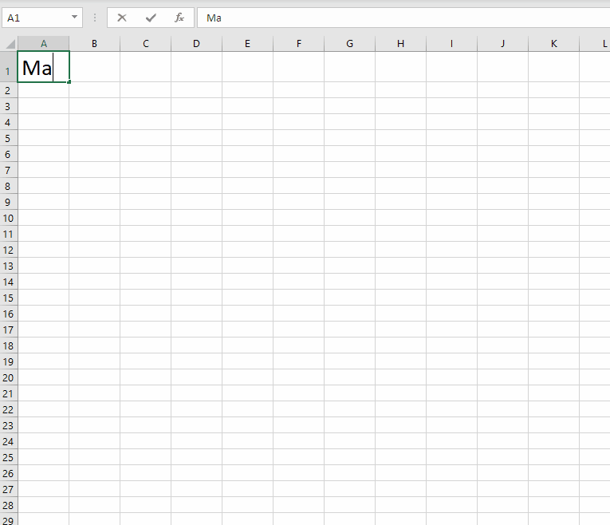
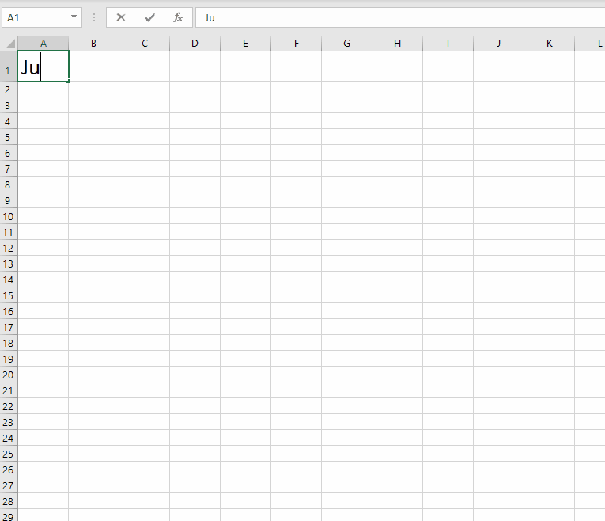

# JuliaExcel

Call Julia functions from Microsoft Excel worksheets and from VBA. Compatible with Excel's dynamic array functions.

## Contents
[Installation](#installation)  
[Functions](#functions)  
[Demo](#demo)  
[Example VBA](#example-vba)  
[Function Documentation](#function-documentation)  
&nbsp;&nbsp;&nbsp;&nbsp;[JuliaLaunch](#julialaunch)  
&nbsp;&nbsp;&nbsp;&nbsp;[JuliaEval](#juliaeval)  
&nbsp;&nbsp;&nbsp;&nbsp;[JuliaCall and JuliaCall2](#juliacall)  
&nbsp;&nbsp;&nbsp;&nbsp;[JuliaSetVar](#juliasetvar)  
[Alternatives](#alternatives)  
[How JuliaExcel works](#how-juliaexcel-works)  
[Shortcomings](#shortcomings)  

## Installation

 * Both [Julia](https://julialang.org/) and Microsoft Office must be installed on your PC, with Excel not running.
 * Launch Julia and switch to the Package REPL with the `]` key.
 * Type `add https://github.com/PGS62/JuliaExcel.jl` followed by the `Enter` key.
 * Exit the Package REPL with the `Backspace` key, then type `using JuliaExcel` followed by `Enter`.
 * Type `JuliaExcel.installme()` followed by `Enter`.
 * Click through a couple of dialogs.
 * Launch Excel. Check that the JuliaExcel functions are available by typing `=Julia` into a worksheet cell and checking that the auto-complete offers `JuliaCall`, `JuliaEval`, `JuliaInclude` etc.


## Functions
JuliaExcel makes the following functions available from Excel worksheets and from VBA:

|Name|Description|
|----|-----------|
|[JuliaLaunch](#julialaunch)|Launches a local Julia session which "listens" to the current Excel session and responds to calls to JuliaEval etc..|
|[JuliaInclude](#juliainclude)|Load a Julia source file into the Julia process, to make additional functions available via JuliaEval and JuliaCall.|
|[JuliaEval](#juliaeval)|Evaluate a Julia expression and return the result to an Excel worksheet.|
|[JuliaEvalFromVBA](#juliaevalfromvba)|Evaluate a Julia expression and return the result to VBA, tuned for use from VBA, rather than from a worksheet.|
|[JuliaCall](#juliacall)|Call a named Julia function, passing in data from the worksheet.|
|[JuliaCall2](#juliacall2)|Call a named Julia function, passing in data from the worksheet, with control of worksheet calculation dependency.|
|[JuliaCallFromVBA](#juliacallfromvba)|Call a named Julia function from VBA code, tuned for use from VBA, rather than from a worksheet.|
|[JuliaSetVar](#juliasetvar)|Set a global variable in the Julia process.|


## Demo
Here's a quick demonstration of the functions in action.
 * See how the Julia session on the left responds to the action in Excel on the right.
 * The annotations in brown text ("Formula at...") are to make the what's happening in the demo clearer. They won't appear when you try JuliaExcel for yourself!
 * You can replay the GIF by hitting F5.


## Example VBA
The VBA code below makes a call to `JuliaLaunch` and `JuliaEval` and then pastes the result to range A1:J10 in a new worksheet. To run it, make sure that the project has a reference to JuliaExcel (VBA editor, Tools menu -> References).

```vba
Sub DemoCallFromVBA()

    Dim ResultFromJulia As Variant, PasteHere As Range
    
    JuliaLaunch
    
    ResultFromJulia = JuliaEval("(1:10).^(1:10)'")

    Set PasteHere = Application.Workbooks.Add.Worksheets(1) _
        .Cells(1, 1).Resize(UBound(ResultFromJulia, 1), _
        UBound(ResultFromJulia, 2))
    
    PasteHere.Value = ResultFromJulia

End Sub
```

## Function Documentation

#### _JuliaLaunch_
Launches a local Julia session which "listens" to the current Excel session and responds to calls to `JuliaEval` etc..
```vba
Function JuliaLaunch(Optional MinimiseWindow As Boolean, Optional ByVal JuliaExe As String)
```

|Argument|Description|
|:-------|:----------|
|`MinimiseWindow`|If TRUE, then the Julia session window is minimised, if FALSE (the default) then the window is sized normally.|
|`JuliaExe`|The location of julia.exe. If omitted, then the function searches for julia.exe, first on the path and then at the default locations for Julia installation on Windows, taking the most recently installed version if more than one is available.|

#### _JuliaInclude_
Load a Julia source file into the Julia process, to make additional functions available via `JuliaEval` and `JuliaCall`.
```vba
Function JuliaInclude(FileName As String, Optional PrecedentCell As Range)
```

|Argument|Description|
|:-------|:----------|
|`FileName`|The full name of the file to be included.|
|`PrecedentCell`|Provides control over worksheet calculation dependency. Enter a cell or range that must be calculated before `JuliaInclude` is executed.|

#### _JuliaEval_
Evaluate a Julia expression and return the result to an Excel worksheet.
```vba
Function JuliaEval(ByVal JuliaExpression As Variant, Optional PrecedentCell As Range)
```

|Argument|Description|
|:-------|:----------|
|`JuliaExpression`|Any valid Julia code, as a string. Can also be a one-column range to evaluate multiple Julia statements.|
|`PrecedentCell`|Provides control over worksheet calculation dependency. Enter a cell or range that must be calculated before `JuliaEval` is executed.|

#### _JuliaEvalFromVBA_
Evaluate a Julia expression and return the result to VBA. Designed for use from VBA rather than a worksheet and differs from `JuliaEval` in handling of 1-dimensional arrays, nested arrays and strings longer than 32,767 characters.
```vba
Function JuliaEvalFromVBA(ByVal JuliaExpression As Variant)
```

|Argument|Description|
|:-------|:----------|
|`JuliaExpression`|Any valid Julia code, as a string. Can also be a one-column range to evaluate multiple Julia statements.|

#### _JuliaCall_
Call a named Julia function, passing in data from the worksheet.
```vba
Function JuliaCall(JuliaFunction As String, ParamArray Args())
```

|Argument|Description|
|:-------|:----------|
|`JuliaFunction`|The name of a Julia function that's defined in the Julia session, perhaps as a result of prior calls to `JuliaInclude`.|
|`Args...`|Zero or more arguments. Each argument may be a number, string, Boolean value, empty cell, an array of such values or an Excel range.|

#### _JuliaCall2_
Call a named Julia function, passing in data from the worksheet, with control of worksheet calculation dependency.
```vba
Function JuliaCall2(JuliaFunction As String, PrecedentCell As Range, ParamArray Args())
```

|Argument|Description|
|:-------|:----------|
|`JuliaFunction`|The name of a Julia function that's available in the Main module of the running Julia session.|
|`PrecedentCell`|Provides control over worksheet calculation dependency. Enter a cell or range that must be calculated before `JuliaCall2` is executed.|
|`Args...`|Zero or more arguments. Each argument may be a number, string, Boolean value, empty cell, an array of such values or an Excel range.|

#### _JuliaCallFromVBA_
Call a named Julia function from VBA code. Designed for use from VBA rather than a worksheet and differs from `JuliaCall` in handling of 1-dimensional arrays, nested arrays and strings longer than 32,767 characters.
```vba
Function JuliaCallFromVBA(JuliaFunction As String, ParamArray Args())
```

|Argument|Description|
|:-------|:----------|
|`JuliaFunction`|The name of a Julia function that's defined in the Julia session, perhaps as a result of prior calls to `JuliaInclude`.|
|`Args...`|Zero or more arguments. Each argument may be a number, string, Boolean value, empty cell, an array of such values or an Excel range.|

#### _JuliaSetVar_
Set a global variable in the Julia process.
```vba
Function JuliaSetVar(VariableName As String, RefersTo As Variant, Optional PrecedentCell As Range)
```

|Argument|Description|
|:-------|:----------|
|`VariableName`|The name of the variable to be set. Must follow Julia's [rules](https://docs.julialang.org/en/v1/manual/variables/#Allowed-Variable-Names) for allowed variable names.|
|`RefersTo`|An Excel range (from which the .Value2 property is read) or more generally a number, string, Boolean, Empty or array of such types. When called from VBA, nested arrays are supported.|
|`PrecedentCell`|Provides control over worksheet calculation dependency. Enter a cell or range that must be calculated before `JuliaSetVar` is executed.|


## Marshalling
Two question arise during implementation:

First, when data from a worksheet (or a VBA variable) is passed to `JuliaCall` or `JuliaSetVar`, that data is marshalled over to Julia. As what Julia type should the data arrive? Mostly, this is easy to decide, but what about one-dimensional arrays (from VBA) or ranges with just one column or one just row from an Excel worksheet? Should these have one-dimension or two over in Julia?

Second, after Julia has evaluated the expression, how should the result be marshalled in the opposite direction, back to Excel? Again this is easy to decide for scalars and two dimensional arrays, but what about for vectors in Julia?

There were three objectives to the design of the marshalling processes:
 1) Round-tripping should work, i.e. the formula `=JuliaCall("identity",x)` should return an identical copy of `x`, whatever the "shape" of `x`.
 2) Matrix arithmetic should work naturally. In Julia, the `*` operator does matrix multiplication, so marshalling should be such that the formula `=JuliaCall("*",Range1,Range2)` performs the same matrix
 multiplication as the formula `=MMULT(Range1,Range2`), which calls Excel's built-in `MMULT`.
 3) To allow use from `JuliaCall` of Julia's dot syntax for function broadcasting.
 
 The following marshalling scheme achieves the objectives:

 * Scalar values in Excel marshal back and forth to Julia as scalar values.
 * Two-dimensional arrays (or ranges) with more than one row and more than one column marshal back and forth as two dimensional.
 * Single-column ranges, when passed to `JuliaCall` or `JuliaSetVar`, arrive in Julia as vectors.
 * Conversely, if the result of an evaluation in Julia is a vector, then the return from 
 `JuliaCall` or `JuliaEval` is a two dimensional array with one column, which occupies a single column range on the worksheet.
 * Single-row ranges, when passed to `JuliaCall` or `JuliaSetVar`, arrive in Julia as 2-dimensional arrays with a single row.

 Click below to see GIFs that illustrate!
 

 <details><summary>Click to see round-tripping of vectors and matrices</summary>
 <p>
  
 
</p>
</details>


<details><summary>Click to see matrix arithmetic</summary><p>

 
</p></details>

<details><summary>Click to see function broadcasting</summary><p>

 
 </p></details>
 
 
## Alternatives

## Compatibility

## How JuliaExcel works

## Shortcomings


Philip Swannell
9 November 2021
