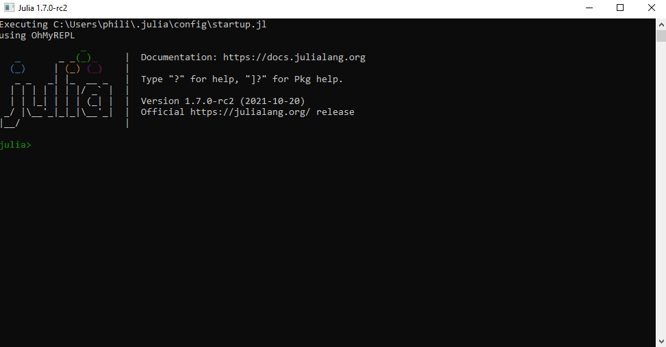
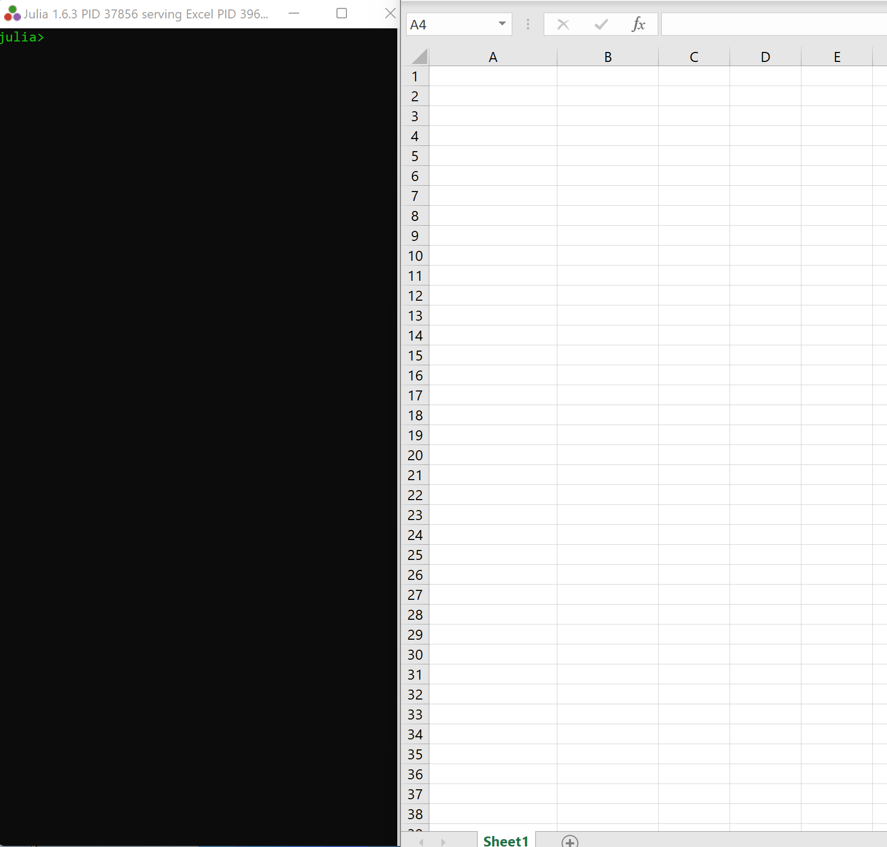

# JuliaExcel

Call Julia from Excel spreadsheets and VBA.

## Contents
[Installation](#installation)  
[Functions](#functions)  
[Demo](#demo)  
[Function Documentation](#function-documentation)  
&nbsp;&nbsp;&nbsp;&nbsp;[JuliaLaunch](#julialaunch)  
&nbsp;&nbsp;&nbsp;&nbsp;[JuliaEval](#juliaeval)  
&nbsp;&nbsp;&nbsp;&nbsp;[JuliaCall and JuliaCall2](#juliacall)  
&nbsp;&nbsp;&nbsp;&nbsp;[JuliaSetVar](#juliasetvar)  
[Alternatives](#alternatives)  
[How JuliaExcel works](#how-juliaexcel-works)  
[Shortcomings](#shortcomings)  

## Installation

 * Both [Julia](https://julialang.org/) and Microsoft Office must be installed on your PC, with Excel not running.
 * Launch Julia and switch to the Package REPL with the `]` key.
 * Type `add https://github.com/PGS62/JuliaExcel.jl` followed by the `Enter` key.
 * Exit the Package REPL with the `Backspace` key, then type `using JuliaExcel` followed by `Enter`.
 * Type `JuliaExcel.installme()` followed by `Enter`.
 * Click through a couple of dialogs.
 * Launch Excel. Check that the JuliaExcel functions are available by typing `=Julia` into a worksheet cell and checking that the auto-complete offers `JuliaCall`, `JuliaEval`, `JuliaInclude` etc.



## Functions
JuliaExcel makes the following functions available from Excel worksheets and from VBA:

|Name|Description|
|----|-----------|
|[JuliaLaunch](#julialaunch)|Launches a local Julia session which "listens" to the current Excel session and responds to calls to JuliaEval etc..|
|[JuliaInclude](#juliainclude)|Load a Julia source file into the Julia process, to make additional functions available via JuliaEval and JuliaCall.|
|[JuliaEval](#juliaeval)|Evaluate a Julia expression and return the result to Excel or VBA.|
|[JuliaCall](#juliacall)|Call a named Julia function, passing in data from the worksheet or from VBA.|
|[JuliaCall2](#juliacall2)|Call a named Julia function, passing in data from the worksheet or from VBA, with control of worksheet calculation dependency.|
|[JuliaSetVar](#juliasetvar)|Set a global variable in the Julia process.|

## Demo
Here's a quick demonstration of the functions in action. Notice how the Julia session responds to the action over in Excel. The annotations in brown text ("Formula at...") are to make the what's happening in the demo clearer. They won't appear when you try JuliaExcel for yourself! Refresh your browser (F5) to replay the GIF.


## Function Documentation

### _JuliaLaunch_
Launches a local Julia session which "listens" to the current Excel session and responds to calls to `JuliaEval` etc..
```vba
Function JuliaLaunch(Optional MinimiseWindow As Boolean, Optional ByVal JuliaExe As String)
```

|Argument|Description|
|:-------|:----------|
|`MinimiseWindow`|If TRUE, then the Julia session window is minimised, if FALSE (the default) then the window is sized normally.|
|`JuliaExe`|The location of julia.exe. If omitted, then the function searches for julia.exe, first on the path and then at the default locations for Julia installation on Windows, taking the most recently installed version if more than one is available.|

### _JuliaInclude_
Load a Julia source file into the Julia process, to make additional functions available via `JuliaEval` and `JuliaCall`.
```vba
Function JuliaInclude(FileName As String)
```

|Argument|Description|
|:-------|:----------|
|`FileName`|The full name of the file to be included.|
|`PrecedentCell`|Provides control over worksheet calculation dependency. Enter a cell or range that must be calculated before `JuliaInclude` is executed.|

### _JuliaEval_
Evaluate a Julia expression and return the result to Excel or VBA.
```vba
Function JuliaEval(ByVal JuliaExpression As Variant, Optional PrecedentCell As Range)
```

|Argument|Description|
|:-------|:----------|
|`JuliaExpression`|Any valid Julia code, as a string. Can also be a one-column range to evaluate multiple Julia statements.|
|`PrecedentCell`|Provides control over worksheet calculation dependency. Enter a cell or range that must be calculated before `JuliaEval` is executed.|

### _JuliaCall_
Call a named Julia function, passing in data from the worksheet or from VBA.
```vba
Function JuliaCall(JuliaFunction As String, ParamArray Args())
```

|Argument|Description|
|:-------|:----------|
|`JuliaFunction`|The name of a Julia function that's defined in the Julia session, perhaps as a result of prior calls to `JuliaInclude`.|
|`Args...`|Zero or more arguments, which may be Excel ranges or variables in VBA code.|

### _JuliaCall2_
Call a named Julia function, passing in data from the worksheet or from VBA, with control of worksheet calculation dependency.
```vba
Function JuliaCall2(JuliaFunction As String, PrecedentCell As Range, ParamArray Args())
```

|Argument|Description|
|:-------|:----------|
|`JuliaFunction`|The name of a Julia function that's available in the Main module of the running Julia session.|
|`PrecedentCell`|Provides control over worksheet calculation dependency. Enter a cell or range that must be calculated before `JuliaCall2` is executed.|
|`Args...`|Zero or more arguments, such as Excel ranges or nested formulas.|

### _JuliaSetVar_
Set a global variable in the Julia process.
```vba
Function JuliaSetVar(VariableName As String, RefersTo As Variant, Optional PrecedentCell As Range)
```

|Argument|Description|
|:-------|:----------|
|`VariableName`|The name of the variable to be set. Must follow Julia's [rules](https://docs.julialang.org/en/v1/manual/variables/#Allowed-Variable-Names) for allowed variable names.|
|`RefersTo`|An Excel range (from which the .Value2 property is read) or more generally a number, string, Boolean, Empty or array of such types. When called from VBA, nested arrays are supported.|
|`PrecedentCell`|Provides control over worksheet calculation dependency. Enter a cell or range that must be calculated before `JuliaSetVar` is executed.|

## Alternatives

## Compatibility

## How JuliaExcel works

## Shortcomings


Philip Swannell
6 November 2021
