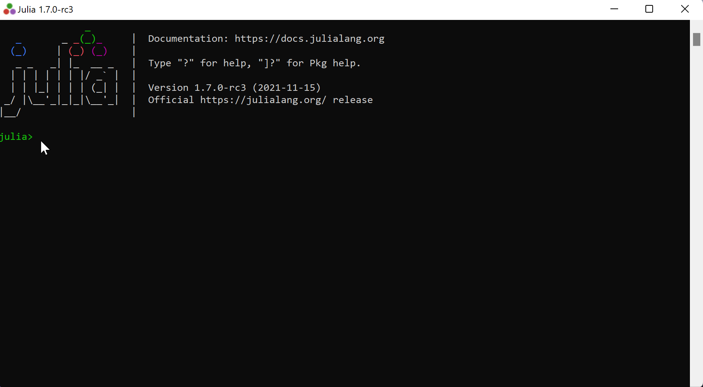
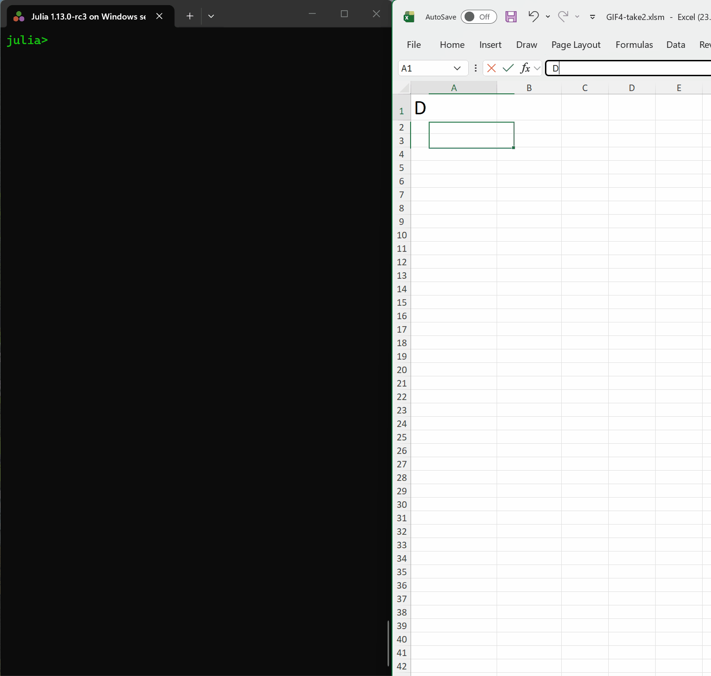
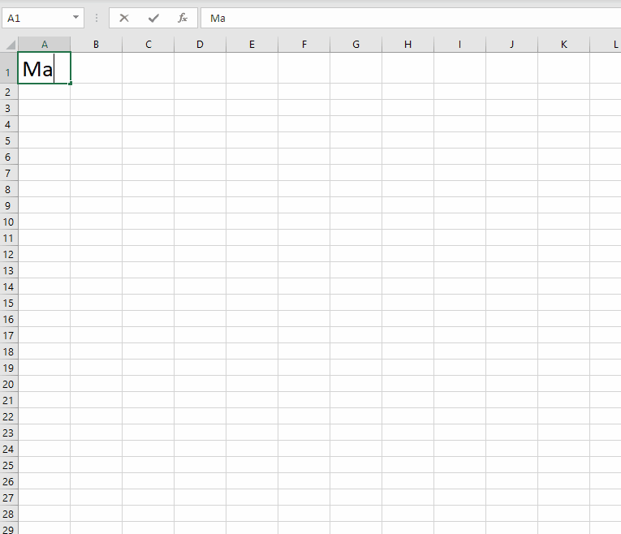
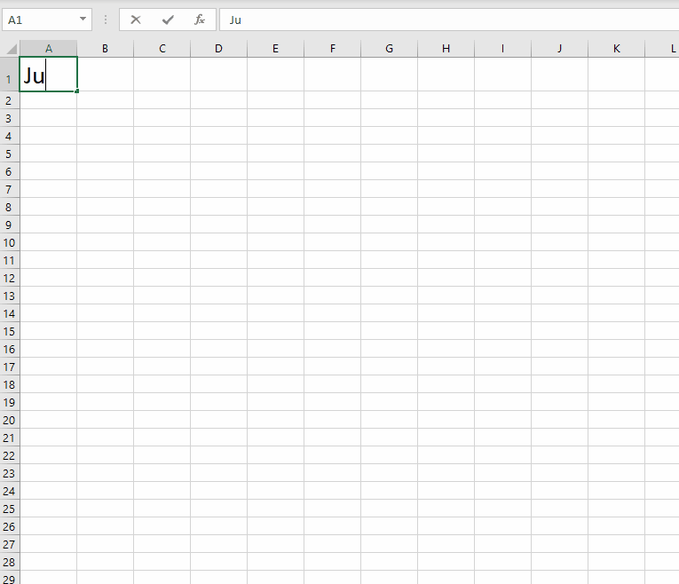

# JuliaExcel

Call [Julia](https://julialang.org/) from Microsoft Excel worksheets and from VBA.  

Compatible with Excel's [dynamic array formulas](https://support.microsoft.com/en-us/office/dynamic-array-formulas-and-spilled-array-behavior-205c6b06-03ba-4151-89a1-87a7eb36e531).

Support Excel for Windows (not Mac). Julia can be run under Windows or Linux (via [WSL](https://docs.microsoft.com/en-us/windows/wsl/about)).

## Contents
[Installation](#installation)  
[Installation (Linux)](#installation-linux)  
[Functions](#functions)   
[Demo](#demo)  
[Example VBA](#example-vba)  
[Function Documentation](#function-documentation)  
[Debugging](#debugging)  
[Marshalling](#marshalling)  
[Alternatives](#alternatives)  
[Compatibility](#compatibility)  
[Viewing the code](#viewing-the-code)  
[How JuliaExcel works](#how-juliaexcel-works)  
[Shortcomings](#shortcomings)  

## Installation
Installation does not require admin rights on the PC.
 * Both Julia and Microsoft Office must be installed on your PC, with Excel not running.
 * Launch Julia, and copy-paste the following command into the REPL:
<!-- CHANGING THE VERSION NUMBER BELOW? DON'T FORGET TO ALSO CHANGE THE VERSION NUMBER IN THE "Installation (Linux)" SECTION -->
   ```
   using Pkg
   Pkg.add(url="https://github.com/PGS62/JuliaExcel.jl")
   ```
   (paste into the REPL is via mouse right-click).
 * Partway through, a Windows dialog will pop up to install the Excel add-in - `Pkg.add` will pause until you've clicked through it. If you ever need to reinstall or repair the add-in later, run `using JuliaExcel;JuliaExcel.installme()`.
 * Launch Excel. Check that the JuliaExcel functions are available by typing `=Julia` into a worksheet cell and checking that the auto-complete offers `JuliaCall`, `JuliaEval`, `JuliaInclude` etc.

The process is illustrated in the GIF below. F5 to replay.



## Installation (Linux)
As an alternative to calling Julia running in a Windows process, JuliaExcel can call Julia running in a Linux process under Windows Subsystem for Linux (WSL). If that's your preference, then in addition to the steps described above, you need to:
 * If necessary, install [WSL](https://docs.microsoft.com/en-us/windows/wsl/install) with the default Linux distribution, Ubuntu.
 * Install Julia under WSL by running `curl -fsSL https://install.julialang.org | sh` at the Ubuntu prompt, per the [official instructions](https://julialang.org/downloads/). This installs `juliaup`, which puts `julia` on the PATH automatically.
 * At the Julia prompt (under WSL) install JuliaExcel by copy-pasting   
  `using Pkg; Pkg.add(url="https://github.com/PGS62/JuliaExcel.jl")` into the REPL. 

## Functions
JuliaExcel makes the following functions available from Excel worksheets and from VBA:

|Name|Description|
|----|-----------|
|[JuliaLaunch](#julialaunch)|Launches a local Julia session which listens to the current Excel session and responds to calls to `JuliaEval` etc..|
|[JuliaInclude](#juliainclude)|Load a Julia source file into the Julia process, to make additional functions available via `JuliaEval` and `JuliaCall`.|
|[JuliaEval](#juliaeval)|Evaluate a Julia expression and return the result to an Excel worksheet.|
|[JuliaCall](#juliacall)|Call a named Julia function, passing in data from the worksheet. Returns an error string for results that cannot be displayed on a worksheet (nested arrays, dictionaries etc). `JuliaCallVBA` lifts those restrictions.|
|[JuliaSetVar](#juliasetvar)|Set a global variable in the Julia process.|
|[JuliaEvalVBA](#juliaevalvba)|Evaluate a Julia expression from VBA . Differs from `JuliaCall` in handling of 1-d arrays and strings longer than 32,767 characters. May return data of types that cannot be displayed on a worksheet, such as a dictionary or an array of arrays.|
|[JuliaCallVBA](#juliacallvba)|Call a named Julia function from VBA. Differs from `JuliaCall` in handling of 1-d arrays and strings longer than 32,767 characters. May return data of types that cannot be displayed on a worksheet, such as a dictionary, an array of arrays, or arrays of dimension up to 9.|
|[JuliaIsRunning](#juliaisrunning)|Returns TRUE if an instance of Julia is running and "listening" to the current Excel session, or FALSE otherwise.|

## Demo
Here's a quick demonstration of the functions in action.
 * See how the Julia session on the left responds to the action in Excel on the right, once `display_results(true)` has been called (the formula at B6 does this).
 * The annotations in brown text ("Formula at...") are to make what's happening in the demo clearer. They won't appear when you try JuliaExcel for yourself!
 * Replay the GIF by refreshing you browser (F5).


## Example VBA
The VBA code below makes a call to `JuliaLaunch` and `JuliaEvalVBA` and then pastes the result to range A1:J10 in a new worksheet. To run it, make sure that the project has a reference to JuliaExcel (VBA editor, Tools menu -> References).

```vba
Sub DemoCallVBA()

    Dim ResultFromJulia As Variant, PasteHere As Range
    
    JuliaLaunch
    
    ResultFromJulia = JuliaEvalVBA("(1:10).^(1:10)'")

    Set PasteHere = Application.Workbooks.Add.Worksheets(1) _
        .Cells(1, 1).Resize(UBound(ResultFromJulia, 1), _
        UBound(ResultFromJulia, 2))
    
    PasteHere.Value = ResultFromJulia

End Sub
```

## Function Documentation

### `JuliaLaunch`
Launches a local Julia session which listens to the current Excel session and responds to calls to `JuliaEval` etc..
```vba
Public Function JuliaLaunch(Optional UseLinux As Boolean, Optional MinimiseWindow As Boolean, _
          Optional ByVal CommandLineOptions As String, Optional ByVal Packages As String, _
          Optional ByVal BashStatements As String, Optional TimeOut As Long = 30)
```

|Argument|Description|
|:-------|:----------|
|`UseLinux`|TRUE to run Julia as a Linux process under Windows Subsystem for Linux; FALSE (the default) to run as a Windows process.|
|`MinimiseWindow`|If TRUE, then the Julia session window is minimised; if FALSE (the default) then the window is sized normally.|
|`CommandLineOptions`|Command line options set when launching Julia.<br/>Example : `--banner=no`.<br/>If `CommandLineOptions` does not include a --threads option, `--threads=auto,1` is appended automatically, giving the Julia session a dedicated interactive thread alongside its default thread pool. Without a dedicated interactive thread, HTTP.jls server tasks share Julia's single thread with whatever expression is currently being evaluated, which can leave the server unable to respond to Excel - or even to shut down cleanly - while a long-running or blocking evaluation is in progress. Supplying your own `--threads` option (e.g. `--threads=8,2`) disables this automatic behaviour, so include a dedicated interactive thread of your own if you need that reliability. https://docs.julialang.org/en/v1/manual/command-line-options/|
|`Packages`|`Packages` to load, which must be available in the default Julia environment (or environment set via the `--project` command line option). Delimit multiple packages with commas.|
|`BashStatements`|Relevant only when `UseLinux` is TRUE. Bash statements executed prior to launching Julia, which can be used to set environment variables. Example `export JULIA_PKG_DEVDIR=/mnt/c/Projects`. Delimit multiple statements with the line feed character.|
|`TimeOut`|The number of seconds to wait for Julia to fully start (including any package precompilation) before `JuliaLaunch` gives up waiting and returns an informational message rather than an error - Julia is not killed, and calling `JuliaLaunch` or `JuliaEval` again once it has finished starting will work normally. A separate, much shorter internal check (the lesser of `TimeOut` and 5 seconds) detects a genuine launch failure, e.g. from mal-formed `CommandLineOptions`, and reports that as an error immediately. `TimeOut` is optional and defaults to 30.|

### `JuliaInclude`
Load a Julia source file into the Julia process, to make additional functions available via `JuliaEval` and `JuliaCall`.
```vba
Public Function JuliaInclude(FileName As String)
```

|Argument|Description|
|:-------|:----------|
|`FileName`|The full name of the file to be included.|

### `JuliaEval`
Evaluate a Julia expression and return the result to an Excel worksheet.
```vba
Public Function JuliaEval(ByVal JuliaExpression As Variant)
```

|Argument|Description|
|:-------|:----------|
|`JuliaExpression`|Any valid Julia code, as a string. Can also be a one-column range to evaluate multiple Julia statements.|

### `JuliaCall`
Call a named Julia function, passing in data from the worksheet. Returns an error string for results that cannot be displayed on a worksheet (nested arrays, dictionaries etc). `JuliaCallVBA` lifts those restrictions.
```vba
Public Function JuliaCall(JuliaFunction As String, ParamArray Args())
```

|Argument|Description|
|:-------|:----------|
|`JuliaFunction`|The name of a Julia function visible from the Julia REPL.|
|`Args...`|Zero or more arguments. Each may be a number, string, Boolean, empty cell, array or Range. Ranges are expanded to their .Value2 before encoding.|

### `JuliaSetVar`
Set a global variable in the Julia process.
```vba
Public Function JuliaSetVar(VariableName As String, RefersTo As Variant)
```

|Argument|Description|
|:-------|:----------|
|`VariableName`|The name of the variable to be set. Must follow Julia's [rules](https://docs.julialang.org/en/v1/manual/variables/#Allowed-Variable-Names) for allowed variable names.|
|`RefersTo`|An Excel range (from which the .Value2 property is read) or more generally a number, string, Boolean, Empty or array of such types. When called from VBA, nested arrays are supported.|

### `JuliaEvalVBA`
Evaluate a Julia expression from VBA . Differs from `JuliaCall` in handling of 1-d arrays and strings longer than 32,767 characters. May return data of types that cannot be displayed on a worksheet, such as a dictionary or an array of arrays.
```vba
Public Function JuliaEvalVBA(ByVal JuliaExpression As Variant)
```

|Argument|Description|
|:-------|:----------|
|`JuliaExpression`|Any valid Julia code, as a string. Can also be a one-column range to evaluate multiple Julia statements.|

### `JuliaCallVBA`
Call a named Julia function from VBA. Differs from `JuliaCall` in handling of 1-d arrays and strings longer than 32,767 characters. May return data of types that cannot be displayed on a worksheet, such as a dictionary, an array of arrays, or arrays of dimension up to 9.
```vba
Public Function JuliaCallVBA(JuliaFunction As String, ParamArray Args())
```

|Argument|Description|
|:-------|:----------|
|`JuliaFunction`|The name of a Julia function visible from the Julia REPL.|
|`Args...`|Zero or more arguments. Each may be a number, string, Boolean, empty cell, array or Range. Ranges are expanded to their .Value2 before encoding.|

### `JuliaIsRunning`
Returns TRUE if an instance of Julia is running and "listening" to the current Excel session, or FALSE otherwise.
```vba
Public Function JuliaIsRunning() As Boolean
```


## Debugging
Every call to `JuliaCall`/`JuliaCallVBA`/`JuliaEval`/`JuliaEvalVBA` leaves a trace behind in Julia, so a problem can be debugged at the REPL without needing to repeat the call from Excel:

* `JuliaExcel.last_question` is the expression that was evaluated - either the exact string passed to `JuliaEval`/`JuliaEvalVBA`, or, for `JuliaCall`/`JuliaCallVBA`, a reconstructed call such as `myfunction(JuliaExcel.args_from_xl...)`.
* `JuliaExcel.last_answer` is the value that was (or would have been) returned to Excel.
* `JuliaExcel.args_from_xl` holds the arguments most recently passed from Excel to `JuliaCall`/`JuliaCallVBA`.
* `JuliaExcel.answer_again()` evaluates `last_question` again, directly - unlike the original call, a failure here raises normally, so tools such as `@enter` or an Infiltrator breakpoint work as expected.

All of these only reflect the most recent call, so debug before making another one. Call `JuliaExcel.display_results(true)` to also have each call and its result echoed to the Julia console as it happens.

## Marshalling
Two question arose during implementation:

First, when data from a worksheet (or a VBA variable) is passed to `JuliaCall` or `JuliaSetVar`, that data is marshalled over to Julia. As what Julia type should the data arrive? Mostly, this is easy to decide, but what about one-dimensional arrays (from VBA) or ranges with just one column or one just row from an Excel worksheet? Should these have one-dimension or two over in Julia?

Second, after Julia has evaluated the expression, how should the result be marshalled in the opposite direction, back to Excel? Again, this is easy to decide for scalars and two dimensional arrays, but what about for vectors in Julia?

There were three objectives to the design of the marshalling processes:
 1) Round-tripping should work, i.e. the formula `=JuliaCall("identity",x)` should return an identical copy of `x`, whatever the "shape" of `x`.
 2) Matrix arithmetic should work naturally. In Julia, the `*` operator does matrix multiplication, so marshalling should be such that the formula `=JuliaCall("*",Range1,Range2)` performs the same matrix
 multiplication as the formula `=MMULT(Range1,Range2`), which calls Excel's built-in matrix multiplier.
 3) To allow use from `JuliaCall` of Julia's dot syntax for function broadcasting.
 
 The following marshalling scheme achieves the objectives:
 * Scalar values in Excel marshal back and forth to Julia as scalar values.
 * Two-dimensional arrays (or ranges) with more than one row and more than one column marshal back and forth as two-dimensional.
 * Single-column ranges, when passed to `JuliaCall` or `JuliaSetVar`, arrive in Julia as vectors.
 * Conversely, if the result of an evaluation in Julia is a vector, then the return from 
 `JuliaCall` or `JuliaEval` is a two dimensional array with one column, which occupies a single-column range on the worksheet.
 * Single-row ranges, when passed to `JuliaCall` or `JuliaSetVar`, arrive in Julia as 2-dimensional arrays with a single row.

For calls from VBA:
 * Vectors (one-dimensional arrays) in VBA are marshalled to vectors in Julia.
 * Vectors in Julia are marshalled by `JuliaCallVBA` and `JuliaEvalVBA` to vectors in VBA. The objective again is to achieve correct round-tripping, though this time VBA variable to and from Julia variable, as opposed to worksheet contents to and from Julia variable.

 Click the black triangles below to see illustrations.
 
 <details><summary><u>Round-tripping of vectors and matrices</u></summary>
 <p>
  
 
</p>
</details>

<details><summary>Matrix arithmetic</summary><p>

 
</p></details>

<details><summary>Function broadcasting</summary><p>

 
 </p></details>
  
## Alternatives
There is one alternative method of calling Julia from Excel of which I am aware:  

https://github.com/JuliaComputing/JuliaInXL.jl  

JuliaComputing made JuliaInXL open source in October 2021; it previously required a licence for commercial use. As of August 2026, JuliaInXL is not compatible with dynamic array formulas, and does not permit calling Julia from VBA. My tests indicate that JuliaInXL and JuliaExcel have broadly similar performance in terms of latency and speed of data transfer.

## Compatibility
JuliaExcel has been tested on Excel under Microsoft 365, both 32-bit and 64-bit. It _should_ work on earlier versions of Excel (perhaps back to Excel 2010) but it has not been tested on them.

## How JuliaExcel works
JuliaExcel communicates between Excel and Julia over a local HTTP connection:
1) `JuliaLaunch` starts a Julia process (as a normal Windows process, or under WSL) running a small HTTP server (`JuliaExcel.start_server()`) on a free local port, and writes that port number to a file so VBA can discover it. If a session for the current Excel process already appears to be running, `JuliaLaunch` checks that it's actually responding before reusing it, rather than starting a duplicate.
2) `JuliaEval` POSTs the Julia expression as plain text to the server's `/eval` endpoint. The Julia function `srv_eval_inner` (in `comms.jl`) evaluates it with `Meta.parse`/`eval` and returns the result - encoded in JuliaExcel's own wire format - in the HTTP response body.
3) `JuliaCall` and `JuliaCallVBA` instead encode the function name and its arguments (marshalled per the rules described in [Marshalling](#marshalling)) into that same wire format and POST it to the `/call` endpoint. `srv_call_inner` decodes it and invokes the named function directly, returning the result the same way. This avoids `Meta.parse`ing a literal expression, which is slow for calls passing large arrays.
4) VBA unserialises the response body back into worksheet values or VBA variables.

Other points to note:
 * The wire format was designed above all to be fast to parse in VBA: its length-prefixes let VBA just slice strings at known offsets. JSON was the obvious alternative but requires bracket-matching and escape handling. JSON also has no native support for 2-D arrays (a worksheet range), only nested 1-D arrays, and a much thinner type system than VBA's Variant (no distinction between e.g. Long and Double).
 * Each `JuliaEval`/`JuliaCall` is a simple synchronous HTTP request/response. If Julia isn't there to answer (e.g. after `=JuliaEval("exit()")`), the request fails with a connection error, which VBA reports as a normal error.
 * Best performance would still be achieved using C via the [Excel SDK](https://docs.microsoft.com/en-us/office/client-developer/excel/welcome-to-the-excel-software-development-kit) and [Julia Embedding](https://docs.julialang.org/en/v1/manual/embedding/).

## Viewing the code
The VBA project is password protected to prevent accidental changes. You can see the VBA code [here](vba/JuliaExcel.xlam/VBA), or view it in JuliaExcel.xlam by unprotecting with the password "JuliaExcel". Julia source code is always visible on your PC, and the [@functionloc](https://docs.julialang.org/en/v1/stdlib/InteractiveUtils/#InteractiveUtils.@functionloc) macro is an easy way to locate the code of any function you're interested in.

## Shortcomings
Given how JuliaExcel works, with serialisation done in VBA - an interpreted language - the most obvious shortcoming is the performance of data transfer between Excel and Julia for large arrays. In practice this is rarely a problem: latency for a simple call is a couple of milliseconds, and marshalling even a 100,000-element array takes a few tenths of a second - typically small compared with the execution time of the Julia code doing the actual work. I wrote JuliaExcel for a project where latency and marshalling time were indeed much smaller than Julia execution time.

&nbsp;

&nbsp;

Philip Swannell  
8 December 2021  
Last updated 22 August 2026
